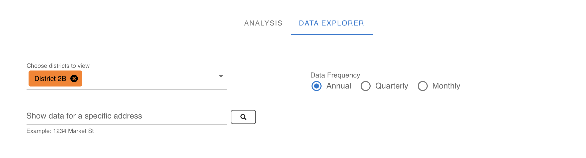
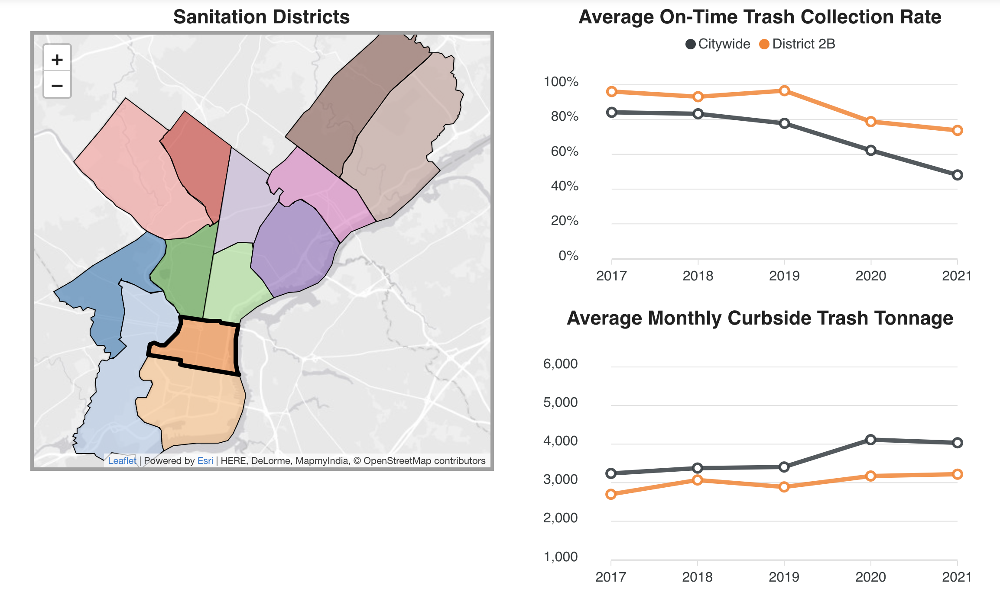

# Data Release: Sanitation Performance Metrics

The code behind the interactive report on Sanitation performance metrics. The interactive report is available [here](https://controller.phila.gov/philadelphia-audits/data-release-sanitation/#/).




## Project setup
```
yarn install
```

### Compiles and hot-reloads for development
```
yarn serve
```

### Compiles and minifies for production
```
yarn build
```

### Lints and fixes files
```
yarn lint
```

### Customize configuration
See [Configuration Reference](https://cli.vuejs.org/config/).
